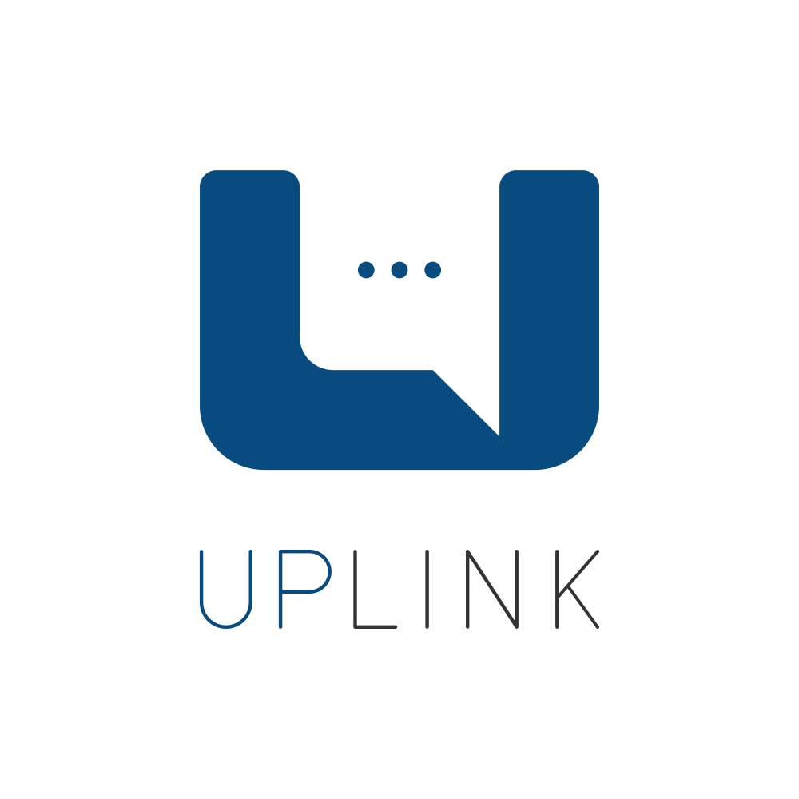

[](https://uplink.belunar.com)

## Codebase

#### Technologies

- **RDS**: MySQL data storage for API
- **DynamoDB**: NoSQL data storage for authentication records
- **GraphQL**: API, powered by Apollo
- **Typescript**: Type-safe Javascript
- **Twilio**: Programmable communications

#### Project Structure

```sh
src/
├── @types # Typed definitions
├── api # GraphQL definitions
│   ├── mutations # Mutation resolvers for each type
│   ├── queries # Query resolvers for each type
│   └── types # GraphQL type definitions
├── context # Instanced context with services and data loaders
│   └── interfaces # context type definitions
├── controllers # All controllers for API models
├── enums # Project enumerators
├── handlers # Serverless handlers for Intake and API endpoints
├── intake # Intake functions
├── lib # Helper scripts
├── models # DynamoDB model definitions
├── routes # Router definitions
└── server # Koa Server
    ├── container # Awilix dependency injection
    └── middleware # All Koa middleware
```

### Development
### First time setup/New stage setup

```bash
 git clone https://github.com/LaunchThat/LTAppsApi.git
```
```bash
~/uplink: yarn # or npm install
```

Add/Update `env.uplink.cli` with database connection values in `/cli`
```bash
~/LTAppsAPI:
  yarn db:uplink migrate:latest
  yarn db:uplink seed
```

### Available commands

#### Formatting

-- Prettier formatting on codebase

```sh
  yarn format
```

#### Linting
- TSLint
```sh
  yarn lint
```

#### Testing
-- Mocha/Istanbul
```sh
  sls offline
  yarn test
```

#### Documentation
-- TypeDoc
* Must run `sls offline` before `apidoc`

```sh
  yarn doc # Generate TypeDoc system documentation
  yarn apidoc # Generate SCHEMA.md for GraphQL API
```

[API DOCUMENTATION](./SCHEMA.md)

#### Routes
- `/api`: GraphQL endpoint
  - `/graphiql`: GraphQL built-in editor, only available locally and in staging stage
- `/intake`
  - `/text`: SMS/MediaMessages endpoint for twilio requests
  - `/voice`: Voice endpoint for twilio requests

#### Running locally
```bash
~/uplink: sls offline --stage=staging
```
Defaults to  `http://localhost:3001`

The existing development environments are:
- `staging`: Shared staging build for testing the UI and new fetaures
- `qa`: "Stable" QA environment for Damien to test new/existing features in
- `demo`: A stable environment equal with Production used by Sales to run tests

#### Debugging locally with VS Code
In order for VS Code to understand how to match a breakpoint to a source line of code, [webpack]( https://webpack.js.org/configuration/devtool) must generate [source maps](https://stackoverflow.com/questions/17493738/what-is-a-typescript-map-file). Furthermore, VS Code debugger must have a [launch configuration](https://code.visualstudio.com/docs/editor/debugging#_launch-configurations) describing how to launch serverless offline and locate the generated source maps.

*Debugging Configuration Checklist*
* Configure webpack to generate source maps
  1. Set devtool
  2. Set build artifact output path 
  3. Configure webpack to include [absolute resource path](https://stackoverflow.com/questions/42126421/webpack-vs-code-sourcemaps-in-serverless)

*Example Launch Configuration (launch.json)*
Note: The JSON specification does not support comments. However, VS Code does for certain [configuration files](https://code.visualstudio.com/docs/languages/json#_json-with-comments).
```
{
    // Use IntelliSense to learn about possible attributes.
    // Hover to view descriptions of existing attributes.
    // For more information, visit: https://go.microsoft.com/fwlink/?linkid=830387
    "version": "0.2.0",
    "configurations": [
        {
            "protocol": "inspector",
            "type": "node",
            "request": "launch",
            "name": "Launch Staging Offline",
            "cwd": "${workspaceFolder}",
            "program": "/usr/local/bin/serverless",
            "args": [
                "offline",
                "-s staging",
                "-P 3001",
                "--noAuth"
            ],
            "env": {
                "SLS_DEBUG": "*",
                // In case the application checks NODE_ENV
                "NODE_ENV": "staging"
            },
            // serverless-webpack will generate source maps based on webpack.config.js
            // The build path is defined in webpack.config.js.
            "outFiles": [ 
                "${workspaceFolder}/build/dist/**/src/handlers/*.js.map",
                "${workspaceFolder}/build/dist/api/src/handlers/*.js.map",
                "${workspaceFolder}/build/dist/intake/src/handlers/*.js.map",
                "${workspaceFolder}/build/dist/userNumbers/src/handlers/*.js.map",
                "${workspaceFolder}/build/dist/authorizer/src/handlers/*.js.map",
             ],
            "sourceMaps": true
        }
    ]
}
```

Once webpack and the VS Code launch configuration are setup, simply set a breakpoint in the Uplink source code and start the launch configuration in the VS Code debugger.

### Deployment
Uplink has a dependency on [Rookout](https://docs.rookout.com/docs/welcome.html). Rookout requires the gRPC package which builds a native extension. The extension is a 64-bit ELF binary targeting a Linux Lambda platform. A custom deployment workflow builds and packages the gRPC native extension. See [Production Deployment](#production-deploy).

The existing development environments are:
- `staging`: Shared staging build for testing the UI and new fetaures
- `qa`: "Stable" QA environment for Damien to test new/existing features in
- `demo`: A stable environment equal with Production used by Sales to run tests

The existing development environments are:
- `production`: The deprecated production environment hosted on the development AWS account
- `uplink-prod`: The production environment hosted on the primary AWS account

Deploy with the following command replacing NODE_ENV with the correct stage:
```bash
~/uplink: NODE_ENV=staging yarn run deploy
```

#### Deployment and Development Technical Debt
Uplink has code dependencies on common LunarVerse libraries such as lib/lambda-context, lib/zuora-rest-sdk, lib/nos-ql, and core service. The code dependencies are not managed by the package manager and are not documented in the package.json file. The side-effect is Uplink must install ALL dependencies required by external code.

For example, lib/lambda-context depends on the package 'aws-lambda'. Therefore, Uplink must have installed as a dependency 'aws-lambda'.